# MQTT通信协议案例

# Revision History

<table><tr><td>Draft Date</td><td>Revision No.</td><td>Description</td></tr><tr><td>2024/09/30</td><td>V1.0</td><td>1. 初始版本。</td></tr></table>

公司官网：www.tronlong.com 销售邮箱：sales@tronlong.com 公司总机：020-8998-6280 1/18  
技术论坛：www.51ele.net 技术邮箱：support@tronlong.com 技术热线：020-3893-9734

# 目 录

前言.. 3

# 1 MQTT通信协议简介. 4

1.1 概述.  
1.2 应用场景.  
1.3 Mosquitto 工具安装

2mqtt_client案例. .6

2.1 案例说明...   
2.2 案例测试..   
2.2.1评估板发布/上位机订阅. .8   
2.2.2评估板订阅/上位机发布 .9   
2.3 案例编译. .10   
2.4 关键代码.

3 mqtt_sinewave_pub 案例.. .12

3.1 案例说明. 12  
3.2 案例测试..  
3.3 案例编译. 15  
3.4 关键代码. .16

更多帮助. .18

公司官网：www.tronlong.com 销售邮箱：sales@tronlong.com 公司总机：020-8998-6280 2/18  
技术论坛：www.51ele.net 技术邮箱：support@tronlong.com 技术热线：020-3893-9734

# 前言

本文主要介绍创龙科技TL3588-EVM评估板基于MQTT通信协议的开发案例，适用开发环境如下。

Windows 开发环境：Windows 7 64bit、Windows 10 64bit

虚拟机：VMware16.2.5

Linux 开发环境：Ubuntu20.04.6 64bit

U-Boot: U-Bo0t-2017.09

Kernel: Linux-5.10.160、Linux-RT-5.10.160

Debian: Debian 11

LinuxSDK:LinuxSDK-[版本号]（基于rk3588_linux_release_v1.2.1_20230720）

我司提供的 MQTT通信协议开发案例主要包括 mqtt_client 和 mqtt_sinewave_pub，位于产品资料“4-软件资料\Demo\mqtt-demos\”目录下。 包

公司官网：www.tronlong.com 销售邮箱：sales@tronlong.com 公司总机：020-8998-6280 3/18  
技术论坛：www.51ele.net 技术邮箱：support@tronlong.com 技术热线：020-3893-9734

# 1 MQTT通信协议简介

# 1.1概述

MQTT（Message Queuing Telemetry Transport，消息队列遥测传输协议），是一种基于发布/订阅(Publish/Subscribe)模式的“轻量级”通讯协议，该协议构建于TCP/IP 协议上，由 IBM在1999 年发布。MQTT最大优点在于，可以极少的代码和有限的带宽，为连接远程设备提供实时可靠的消息服务。 创龙

MQTT 是轻量、简单、开放和易于实现的，同时作为一种低开销、低带宽占用的即时通讯协议，使其在物联网、小型设备、移动应用等方面有较广泛的应用。

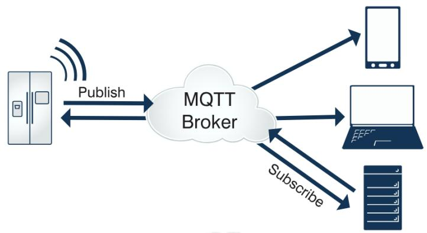  
图1

MQTT具有如下特点：

（1）轻量可靠：MQTT 的报文格式精简、紧凑，可在严重受限的硬件设备和低带宽、高延迟的网络上实现稳定传输。

（2）发布/订阅模式(Publish/Subscribe)：发布/订阅模式的优点在于发布者与订阅者的解耦，实现异步协议。即订阅者与发布者无需建立直接连接，亦无需同时在线。

（3）为物联网而生：提供心跳机制、遗嘱消息、QoS质量等级 $^ +$ 离线消息、主题和安全管理等全面的物联网应用特性。

（4） 生态更完善：覆盖范围广，已成为众多云厂商物联网平台的标准通信协议。

# 因我们的存在，让嵌入式应用更简单

公司官网：www.tronlong.com 销售邮箱：sales@tronlong.com 公司总机：020-8998-6280 4/18  
技术论坛：www.51ele.net 技术邮箱：support@tronlong.com 技术热线：020-3893-9734

# 1.2应用场景

MQTT作为一种低开销，低带宽占用的即时通讯协议，可以极少的代码和带宽为联网设备提供实时可靠的消息服务，适用于硬件资源有限的设备及带宽有限的网络环境。常见的应用场景如下：

(1) 物联网M2M通信，物联网大数据采集(2) 移动即时消息及消息推送。 龙(3) 智能硬件、智能家居、智能电器。(4) 车联网通信，电动车站桩采集。(5) 智慧城市、远程医疗、远程教育。(6) 电力能源、石油能源。

# 1.3 Mosquitto 工具安装

Mosquitto 是一款开源的MQTT消息代理（服务器）软件，提供轻量级的、支持可发布/可订阅的的消息推送模式。我司提供的评估板文件系统已支持 Mosquitto 工具，本文mqtt_client案例采用Mosquitto工具演示 MQTT通信协议的通信功能。由于上位机Ubuntu系统作为通信对象，因此需在 Ubuntu 终端执行如下命令安装 Mosquitto 工具，出现提示时输入"Y"并按下回车即可。 型技

Host#sudo apt-get install mosquitto-clients

# 因我们的存在，让嵌入式应用更简单

公司官网：www.tronlong.com 销售邮箱：sales@tronlong.com 公司总机：020-8998-6280 5/18  
技术论坛：www.51ele.net 技术邮箱：support@tronlong.com 技术热线：020-3893-9734

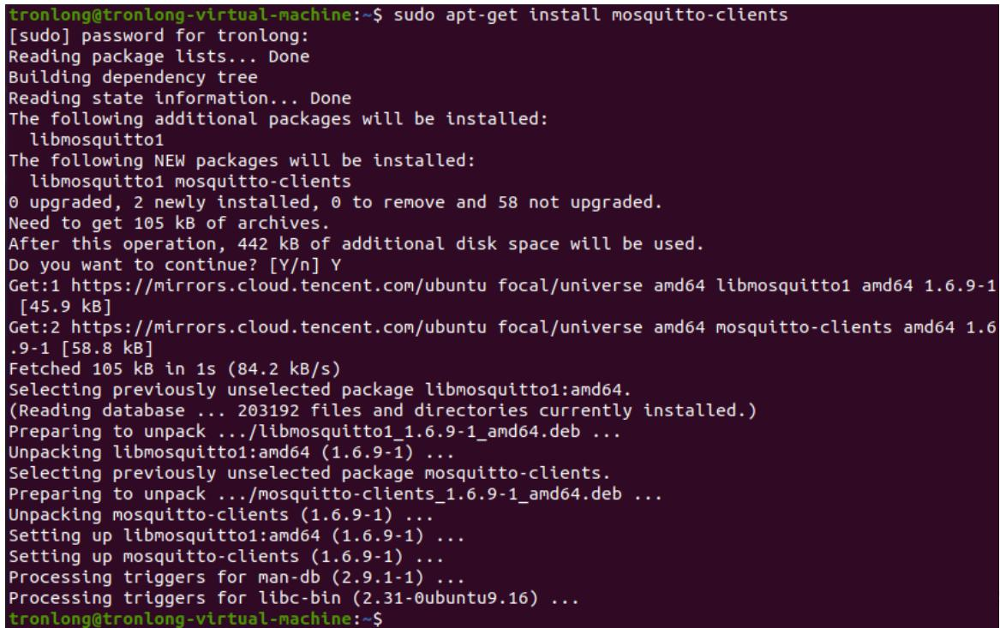  
图2

# 2mqtt_client 案例

# 2.1案例说明

案例功能：使用 libmosquitto(MQTT version 5.0/3.1.1)的 API与 MQTT 代理服务器通信。基于 MQTT通信协议，实现发布和订阅消息功能。

程序流程图如下图所示。

# 因我们的存在，让嵌入式应用更简单

公司官网：www.tronlong.com 销售邮箱：sales@tronlong.com 公司总机：020-8998-6280 6/18  
技术论坛：www.51ele.net 技术邮箱：support@tronlong.com 技术热线：020-3893-9734

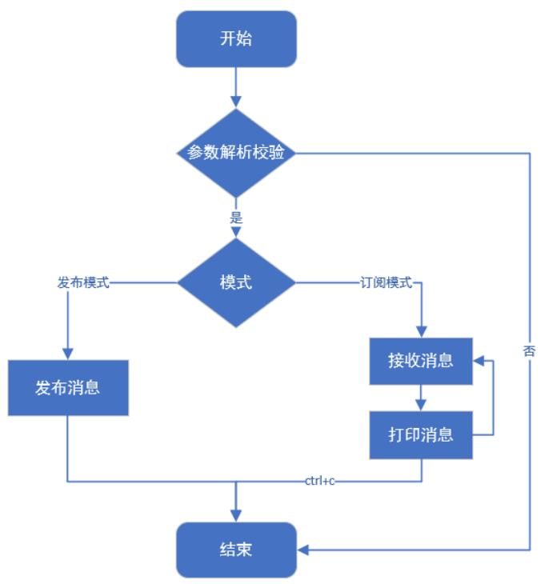  
图3

# 2.2案例测试

本案例使用公网MQTT HiveMQ 服务器与上位机Ubuntu Mosquitto 工具通信。请通过网线将评估板千兆网口 ETH0 RGMII和上位机连接至公网，确保可正常访问互联网。

下表提供了可用的在线公共MQTT服务器，可根据需要自行切换。

表1  

<table><tr><td rowspan=1 colspan=1>服务器名称</td><td rowspan=1 colspan=1>Broker地址</td><td rowspan=1 colspan=1>TCP 端口</td><td rowspan=1 colspan=1>WebSocket</td></tr><tr><td rowspan=1 colspan=1>HiveMQ</td><td rowspan=1 colspan=1>broker.hivemq.com</td><td rowspan=1 colspan=1>1883</td><td rowspan=1 colspan=1>8000</td></tr><tr><td rowspan=1 colspan=1>Mosquitto</td><td rowspan=1 colspan=1>test.mosquitto.org</td><td rowspan=1 colspan=1>1883</td><td rowspan=1 colspan=1>80       创</td></tr><tr><td rowspan=1 colspan=1>Eclipse</td><td rowspan=1 colspan=1>mqtt.eclipseprojects.io</td><td rowspan=1 colspan=1>1883</td><td rowspan=1 colspan=1>80/443</td></tr><tr><td rowspan=1 colspan=1>EMQX（国内）</td><td rowspan=1 colspan=1>broker-cn.emqx.io</td><td rowspan=1 colspan=1>1883</td><td rowspan=1 colspan=1>8083/8084</td></tr></table>

评估板启动,将案例bin 目录下mqtt_client可执行文件拷贝至评估板文件系统的任意目录下，执行如下命令查看程序参数说明。

Target# ./mqtt_client --help

# 因我们的存在，让嵌入式应用更简单

公司官网：www.tronlong.com 销售邮箱：sales@tronlong.com 公司总机：020-8998-6280 7/18  
技术论坛：www.51ele.net 技术邮箱：support@tronlong.com 技术热线：020-3893-9734

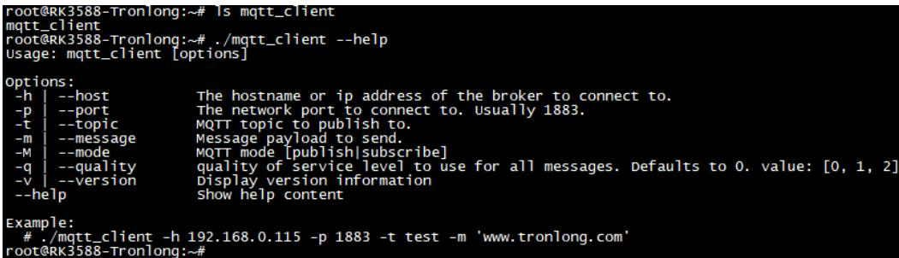  
图4

# 2.2.1 评估板发布/上位机订阅

在上位机执行如下命令，使用 mosquitto_sub 工具订阅 MQTT主题。Host# mosquitto_sub -h broker.hivemq.com -p 1883 -t test/data参数解析：-h：指定MQTT 服务器；-p：指定 MQTT 服务器 TCP 端口；-t：定义MQTT主题，可自定义命名。

图5

在评估板文件系统执行如下命令发布消息至MQTT 服务器。

Target# ./mqtt_client -h broker.hivemq.com -p 1883 -M publish -t test/data -m 'www.tronlong.com'

参数解析：-h：MQTT 服务器-p：MQTT服务器端口 创龙-M：模式，publish 为发布，subscribe 为订阅-t：MQTT主题，可随便命名-m：发布的MQTT 消息

# 因我们的存在，让嵌入式应用更简单

公司官网：www.tronlong.com 销售邮箱：sales@tronlong.com 公司总机：020-8998-6280 8/18  
技术论坛：www.51ele.net 技术邮箱：support@tronlong.com 技术热线：020-3893-9734

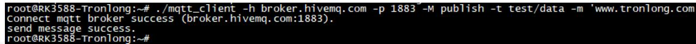  
图6评估板发布

消息发布成功后，上位机将从MQTT服务器接收到对应的消息。

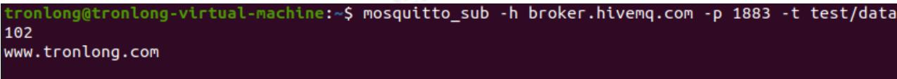  
图7上位机订阅

# 2.2.2评估板订阅/上位机发布

在评估板文件系统执行如下命令订阅 MQTT主题。

# Target#

./mqtt_client -h broker.hivemq.com -p 1883 -M subscribe -t test/data

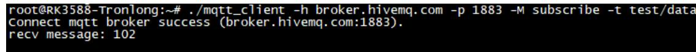  
图8

在上位机执行如下命令发布消息至MQTT 服务器。

Host#mosquitto_pub -h broker.hivemq.com -p 1883 -t test/data -m www.tronlong.com

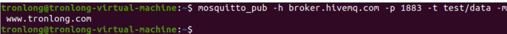  
图9上位机发布

消息发布成功后，评估板将从MQTT 服务器接收到对应消息。

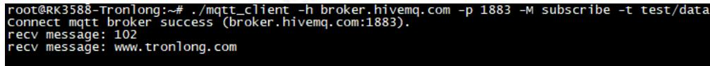  
图 10 评估板订阅

# 因我们的存在，让嵌入式应用更简单

公司官网：www.tronlong.com 销售邮箱：sales@tronlong.com 公司总机：020-8998-6280 9/18  
技术论坛：www.51ele.net 技术邮箱：support@tronlong.com 技术热线：020-3893-9734

# 2.3案例编译

将案例 src 文件夹拷贝至 Ubuntu工作目录下，请先确保已参考《Debian 系统使用手册》编译过 LinuxSDK。在案例 src 目录执行如下命令，配置交叉编译工具链环境变量，并修改Makefile文件。

Host#export PATH $=$ /home/tronlong/RK3588/rk3588_linux_release_v1.2.1/extra-tools/gcc -linaro-10.2.1-2021.01-x86_64_aarch64-linux-gnu/bin:\$PATH

Host#vim Makefile

图11

修改的内容如下：

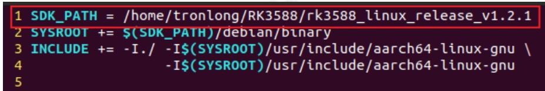  
图12

执行如下命令，进行案例编译。编译完成后在当前目录下生成可执行文件。

Host#make CC=aarch64-linux-gnu-gcc

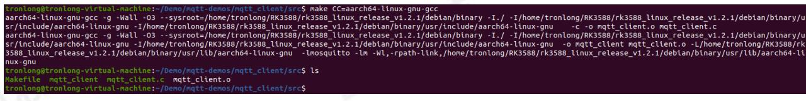  
图13

# 因我们的存在，让嵌入式应用更简单

公司官网：www.tronlong.com 销售邮箱：sales@tronlong.com 公司总机：020-8998-6280 10/18  
技术论坛：www.51ele.net 技术邮箱：support@tronlong.com 技术热线：020-3893-9734

# 2.4关键代码

（1）创建 Mosquitto 实例。

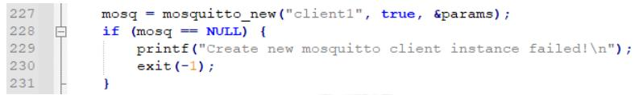  
图14

(2） 设置回调函数。

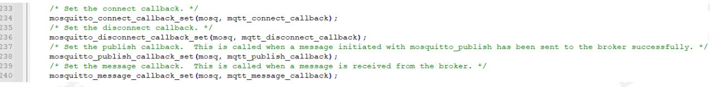  
图15

# （3）连接MQTT服务器。

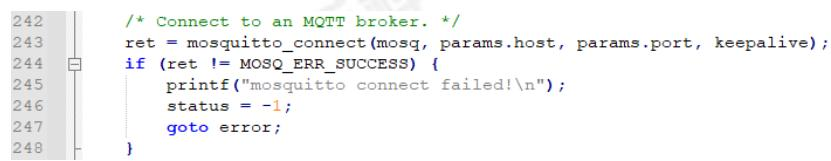  
图16

（4）发布消息。

# 因我们的存在，让嵌入式应用更简单

公司官网：www.tronlong.com 销售邮箱：sales@tronlong.com 公司总机：020-8998-6280 11/18  
技术论坛：www.51ele.net 技术邮箱：support@tronlong.com 技术热线：020-3893-9734

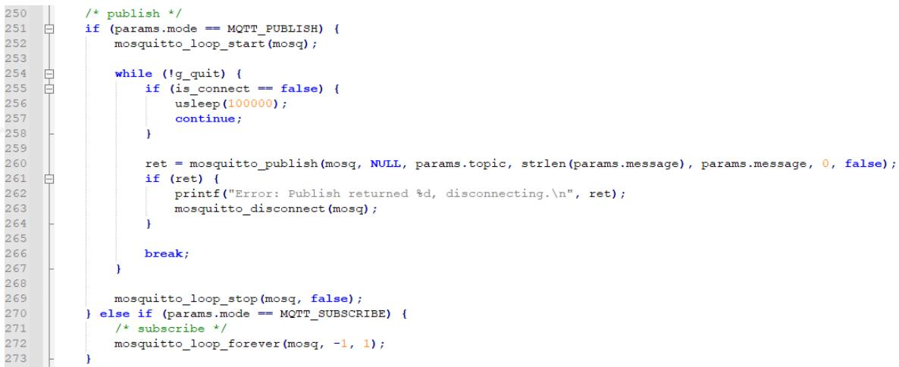  
图17

(5） 订阅主题。

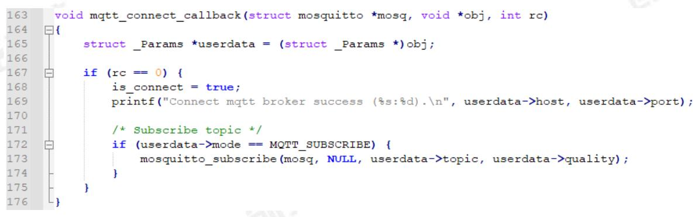  
图18

# 3mqtt_sinewave_pub 案例

# 3.1案例说明

案例功能：使用 libmosquitto(MQTT version 5.0/3.1.1)的 API与 MQTT 代理服务器通信。评估板生成正弦波数据,每秒发送512个采样点的数据至MQTT服务器；上位机通过Web页面从MQTT服务器接收到数据后，将会绘制波形。

程序流程图如下图所示。

# 因我们的存在，让嵌入式应用更简单

公司官网：www.tronlong.com 销售邮箱：sales@tronlong.com 公司总机：020-8998-6280 12/18  
技术论坛：www.51ele.net 技术邮箱：support@tronlong.com 技术热线：020-3893-9734

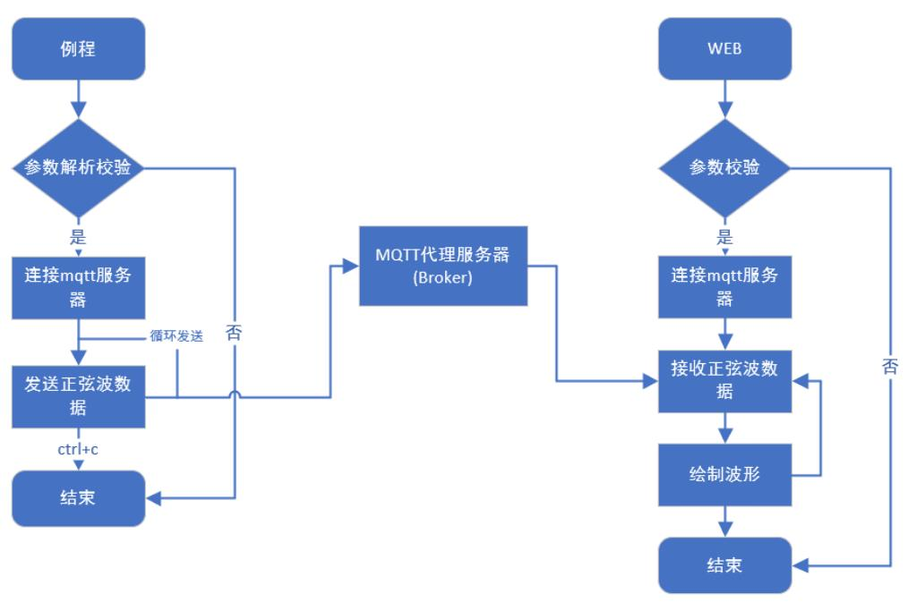  
图19

# 3.2 案例测试

本案例使用公网 MQTT HiveMQ 服务器与上位机Ubuntu Web 程序通信。请通过网线将评估板千兆网口 ETH0 RGMI和上位机连接至公网，确保可正常访问互联网。

评估板启动，将案例bin 目录下 mqtt_sinewave_pub 可执行文件拷贝至评估板文件系统的任意目录下，执行如下命令查看程序参数说明。

Target# ./mqtt_sinewave_pub --help

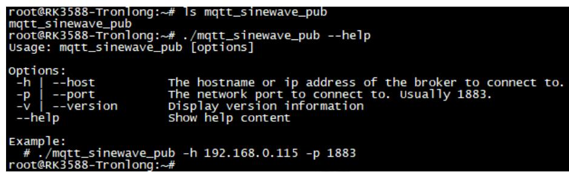  
图20

执行如下命令运行程序，连接MQTT服务器，并发送正弦波数据至MQTT服务器。

Target# ./mqtt_sinewave_pub -h broker.hivemq.com -p 1883

# 因我们的存在，让嵌入式应用更简单

公司官网：www.tronlong.com 销售邮箱：sales@tronlong.com 公司总机：020-8998-6280 13/18  
技术论坛：www.51ele.net 技术邮箱：support@tronlong.com 技术热线：020-3893-9734

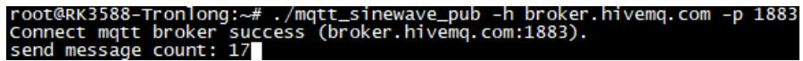  
图21

评估板程序运行后，在上位机使用浏览器打开"tools\web_mqtt_sub\"目录下的 index.html 文件。在弹出的Web 页面（如下图），依次输入MQTT 服务器：broker.hivemq.com，端口号：8000，最后点击连接，Web页面将会从MQTT 服务器获取正弦波数据并进行波形绘制。

备注：ARM 端 MQTT通信协议基于TCP 协议，Web 端 MQTT通信协议基于WebSocket 协议，因此使用的端口号不同。

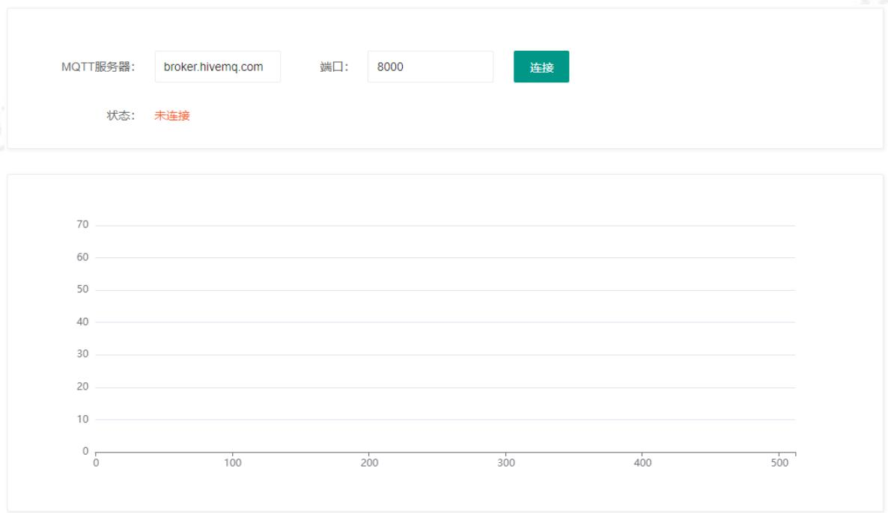  
图22

# 因我们的存在，让嵌入式应用更简单

公司官网：www.tronlong.com 销售邮箱：sales@tronlong.com 公司总机：020-8998-6280 14/18  
技术论坛：www.51ele.net 技术邮箱：support@tronlong.com 技术热线：020-3893-9734

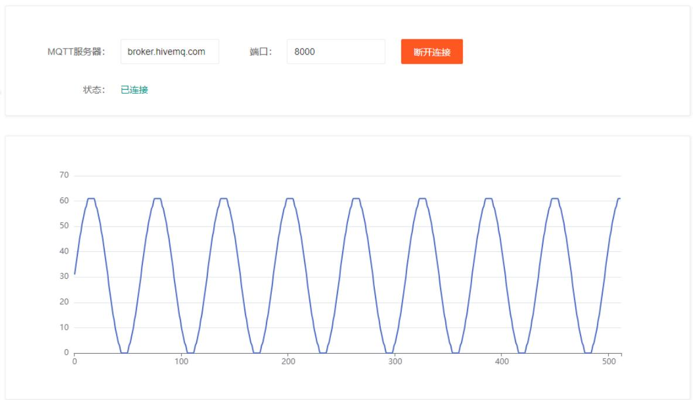  
图23

# 3.3案例编译

将案例 src文件夹拷贝至 Ubuntu 工作目录下，请先确保已参考《Debian 系统使用手册》编译过 LinuxSDK。在案例 src 目录执行如下命令，配置交叉编译工具链环境变量，并修改 Makefile 文件。 龙科

Host#export PATH $=$ /home/tronlong/RK3588/rk3588_linux_release_v1.2.1/extra-tools/gcc -linaro-10.2.1-2021.01-x86_64_aarch64-linux-gnu/bin:\$PATH

Host#vim Makefile

图24

修改的内容如下：

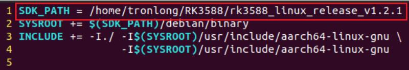  
图25

执行如下命令，进行案例编译。编译完成后在当前目录下生成可执行文件。

Host#make $\complement { \mathsf { C } } =$ aarch64-linux-gnu-gcc

图26

# 3.4关键代码

（1）创建 Mosquitto 实例。

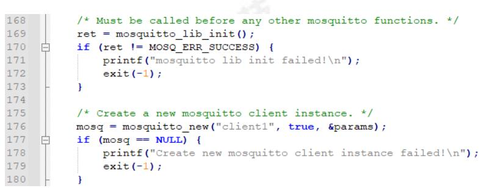  
图27

(2） 设置回调函数。

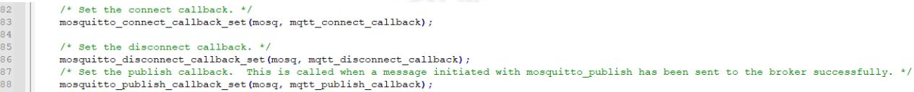  
图28

# 因我们的存在，让嵌入式应用更简单

公司官网：www.tronlong.com 销售邮箱：sales@tronlong.com 公司总机：020-8998-6280 16/18  
技术论坛：www.51ele.net 技术邮箱：support@tronlong.com 技术热线：020-3893-9734

（3）连接MQTT 服务器。

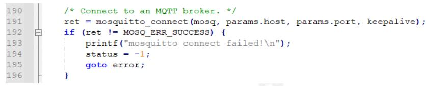  
图29

（4） 发送数据。

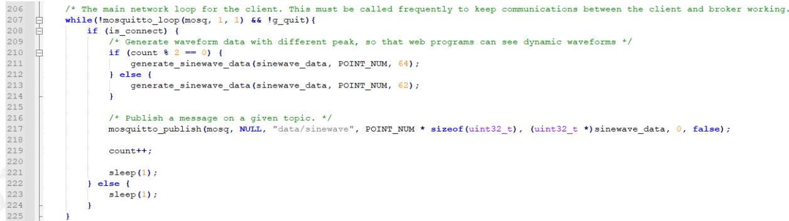  
图30

# 因我们的存在，让嵌入式应用更简单

公司官网：www.tronlong.com 销售邮箱：sales@tronlong.com 公司总机：020-8998-6280 17/18  
技术论坛：www.51ele.net 技术邮箱：support@tronlong.com 技术热线：020-3893-9734

# 更多帮助

销售邮箱：sales@tronlong.com技术邮箱：support@tronlong.com创龙总机：020-8998-6280技术热线：020-3893-9734创龙官网：www.tronlong.com技术论坛：www.51ele.net官方商城：tronlong.tmall.com

# 因我们的存在，让嵌入式应用更简单

公司官网：www.tronlong.com 销售邮箱：sales@tronlong.com 公司总机：020-8998-6280 18/18  
技术论坛：www.51ele.net 技术邮箱：support@tronlong.com 技术热线：020-3893-9734